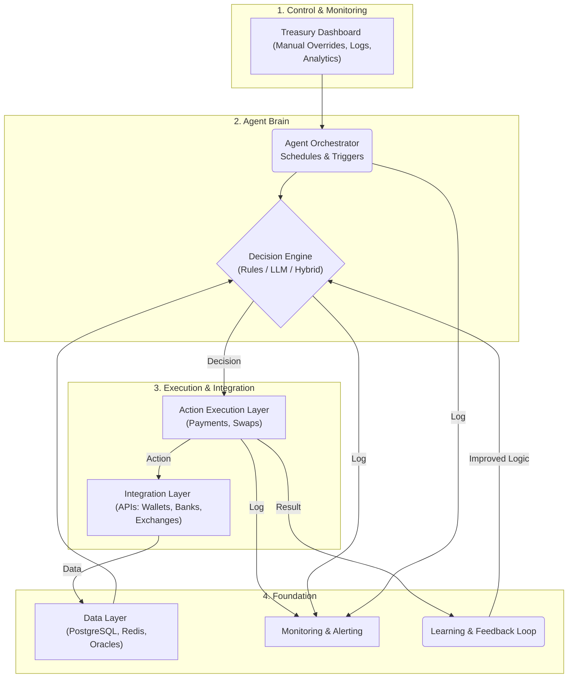
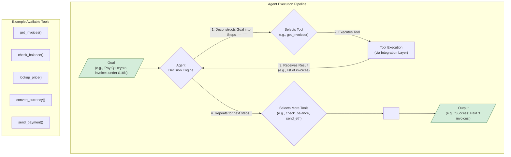

# Agent

This project is an autonomous AI agent designed for financial operations. It can analyze market data, make decisions based on predefined rules and AI models, and execute actions such as cryptocurrency transactions, swaps, and fiat payments automatically.

## System Architecture

The agent is built on a modular, layered architecture to ensure separation of concerns, scalability, and security. Below is a high-level diagram of the system components.

### Agent Execution Pipeline

While the architecture describes the system's components, the following pipeline illustrates how the agent operates at runtime to achieve a goal. The agent works in a loop, breaking down a high-level goal into a sequence of steps, executing them with available tools, and observing the results until the goal is complete.

**Example Walkthrough:**

Given the goal **"Pay Q1 crypto invoices under $10k"**, the agent would perform the following steps:

1.  **Use `get_invoices(quarter="Q1")`**: The agent fetches all invoices for the first quarter.
2.  **Observe**: It gets a list of invoices: `[invoice1, invoice2, invoice3]`.
3.  **Loop through invoices**: For each invoice, it performs the following checks:
    *   **Use `check_usd_balance()`**: Confirms sufficient funds are available.
    *   **Use `lookup_eth_price()`**: Gets the current ETH-to-USD exchange rate.
    *   **Use `convert_usd_to_eth(amount=invoice.amount)`**: Calculates the required ETH.
    *   **Reason**: The agent checks if the payment is valid and within defined limits.
4.  **Use `send_eth(to=invoice.address, amount=eth_amount)`**: If all checks pass, it executes the payment.
5.  **Final Output**: After processing all invoices, the agent outputs a summary: `"Success: Paid 3 invoices for a total of 1.5 ETH ($4,500)"`.

### Core Implementation Strategy

To build the agent described above, we will adopt the following technical strategies:

1.  **Agentic Framework (e.g., LangChain, LangGraph):** We will not build the agent's core reasoning loop from scratch. We will leverage a modern agentic framework to provide the fundamental components of an agent:
    *   **Planning:** The LLM's ability to decompose goals into steps.
    *   **Tool Utilization:** The core functionality for providing, selecting, and executing tools.
    *   **Memory:** Short-term (for in-progress tasks) and long-term (for retaining knowledge over time) memory management.

2.  **Tool-Centric Actions:** Every action the agent can perform will be implemented as a discrete, well-defined **Tool**. For example, `send_payment`, `lookup_price`, and `get_invoices` will be distinct functions that the agent's decision-making engine can choose from to achieve its goals. This makes the system modular and easy to extend.

3.  **Stateful Backend Service:** A persistent backend service will be developed to orchestrate the entire process. This service will:
    *   Manage the state of each agent's task (e.g., running, paused, completed).
    *   Securely execute the tool calls, handling credentials and connections.
    *   Log every step of the agent's reasoning and execution for auditing and debugging via the Treasury Dashboard.
    *   Provide the APIs needed for the UI to monitor and control agent behavior.

### Detailed Architecture & Feature Plan

Here is a detailed breakdown of the features planned for each architectural layer, based on the project action plan.

#### 1. Treasury Dashboard (UI for Controls & Logs)
- **Visual Logging:** A complete visual log of all agent actions (who, what, when, where, why).
- **Manual Overrides:** Critical override features, including manual approvals and a kill switch.
- **System Monitoring:** Dashboards to display system health and monitor transactions.
- **Advanced Filtering:** Support for filtering logs and views by time, currency, counterparty, and status.
- **Exportable Audits:** Ability to export audit trails to PDF and CSV formats.
- **Access Control:** Role-based access control (RBAC) to distinguish between admin and observer roles.

#### 2. Agent Orchestration Layer
- **Scheduling Engine:** A robust scheduler for triggering agents (cron-style or event-based).
- **Stateful Agents:** Support for stateful agent execution, including pause, resume, and retry logic.
- **Flexible Triggers:** Agents can be triggered by time, events (e.g., price spikes), or direct user initiation.
- **Identity & Authorization:** Secure agent identity and authorization to define which agents can act on specific accounts.
- **Lifecycle Logging:** Detailed logs and metrics for the entire agent lifecycle.
- **Dependency Management:** Ability to define a dependency tree for agent execution (e.g., run pre-flight checks before execution).

#### 3. Decision Engine (AI Logic / Rule Layer)
- **Hybrid Logic:** Starts with deterministic, rule-based logic (e.g., from YAML configs) and supports a hybrid model with LLMs.
- **Pluggable Models:** Ability to plug in different models (OpenAI, Claude, local models) as needed.
- **Scenario Simulation:** A "what-if" mode to simulate scenarios (e.g., what if gas > X or FX < Y?).
- **Decision Rationale:** Record the rationale for every decision in the logs for auditability.
- **Confidence Scoring:** Attach a scoring or confidence metric to each decision.
- **Safeguards:** Build in safeguards to prevent actions when conflicting thresholds or conditions are met.

#### 4. Action Execution Layer (Payment / Swap)
- **Abstracted Execution:** A clean, abstract interface for actions (`sendCrypto`, `sendFiat`, `swapAssets`).
- **Resilient Execution:** Automatically handles retries, gas estimation, and resolution for stuck transactions.
- **Time-Sensitive Actions:** Execute actions only if conditions are met (e.g., slippage < 1%).
- **Secure Signing:** Integrate with MPC / multisig signing infrastructure.
- **Settlement Buffers:** Use delay queues or buffers to handle fiat settlement lags.
- **Normalized Responses:** Normalize responses across different payment rails (e.g., tx hashes, SWIFT references).

#### 5. Monitoring & Alerting
- **Real-time Tracking:** Track every agent action in real-time using Grafana or a custom UI.
- **Custom Alerts:** Set up alerts for high slippage, repeated failures, or unexpected behavior.
- **Indexed Logs:** Index all logs in a searchable database like ElasticSearch or Loki.
- **Push Notifications:** Integrate with push notification services (Telegram, Slack, PagerDuty).
- **Visual Dashboards:** Create dashboards to visualize activity by asset, agent, or region.

#### 6. Data Layer (DB + Oracles)
- **Structured Data:** Use PostgreSQL for internal structured data.
- **Caching:** Use Redis for caching frequently accessed data like exchange rates.
- **Oracle Integration:** Connect to multiple oracle sources (Chainlink, CoinGecko, bank FX feeds).
- **On-Chain Data:** Sync chain data via The Graph or Covalent for on-chain analysis.
- **Decision History:** Store past agent decisions to support learning and feedback loops.
- **Input Sanitization:** Sanitize all inputs, especially from third-party oracles.

#### 7. Integration Layer (Wallets, Banks, APIs)
- **Crypto SDKs:** Plug-in crypto libraries like `ethers.js`, `Web3.py`, and the Solana SDK.
- **MPC Wallet Infrastructure:** Integrate with MPC wallet providers like Fireblocks, Lit Protocol, or Gnosis Safe.
- **Fiat APIs:** Connect to fiat rails via Tink, Yapily, or direct OpenBanking APIs.
- **Compliance:** Ensure KYB compliance with all counterparties.
- **Swap Routing:** Route swaps through aggregators like 1inch, Paraswap, 0x, or connect to fiat FX desks.
- **Unified Abstraction:** Create a unified layer to abstract complexities across different banks and wallets.

#### 8. Optional: Learning/Feedback Layer
- **Outcome Storage:** Store the result of each decision (success/fail, duration, fees).
- **Heuristic Improvement:** Train a model or heuristic to detect better decision paths.
- **Auto-Adjustment:** Use feedback loops to automatically adjust decision thresholds.
- **Human-in-the-Loop:** Flag suboptimal actions for human review and correction.

### General Considerations
- **Immutable Logs:** Ensure immutable audit logs for compliance.
- **Data Privacy:** Enforce GDPR and other data privacy regulations.
- **Master Kill Switch:** A system-wide kill switch to suspend all agent activity instantly.
- **Agent Versioning:** Implement agent health scoring and version control.
- **Dry-Run Mode:** A simulated "dry-run" mode for testing agents before live deployment.