# Nxtreasury Agent System

## 🏗️ System Architecture Overview

The system is built on a **hybrid agentic architecture** combining:
- **Cognitive agents** for complex financial reasoning
- **Reactive agents** for real-time monitoring and alerts  
- **Deliberative agents** for strategic planning and risk assessment
- **Tool-calling capabilities** for external API integrations

# Agent Workflow Architecture

The following diagram shows the complete autonomous agent workflow for dual payment processing and investment management:

```mermaid
graph TD
    A["👤 User Request"] --> B["📊 Data Ingestion<br/>(Sync or Upload)"]
    B --> C["🗄️ Database Storage<br/>(User Data & Context)"]
    C --> D["🤖 Autonomous Agent<br/>(BDI Decision Engine)"]
    
    D --> E["💰 Payment Processing<br/>(Primary Action)"]
    D --> F["📈 Investment Analysis<br/>(Secondary Action)"]
    
    E --> G["💸 Execute Payment<br/>(Cross-border, Currency Exchange)"]
    F --> H["🔍 Surplus Detection<br/>(Leftover Funds)"]
    
    H --> I["📊 Investment Opportunity<br/>Evaluation"]
    I --> J["⚖️ Risk Assessment<br/>(Payment + Investment)"]
    
    G --> K["✅ Payment Validation"]
    J --> L["🎯 Investment Execution<br/>(Yield Farming, Staking)"]
    
    K --> M{"❌ Error?"}
    L --> N{"❌ Error?"}
    
    M -->|Yes| O["🔄 Retry Payment<br/>or Alternative Route"]
    N -->|Yes| P["🔄 Retry Investment<br/>or Safe Allocation"]
    
    O --> K
    P --> N
    
    M -->|No| Q["📋 User Approval<br/>(High-Value Transactions)"]
    N -->|No| R["📋 Investment Approval<br/>(Risk Threshold Check)"]
    
    Q --> S["🚀 Final Execution<br/>(Payment Complete)"]
    R --> T["🚀 Final Execution<br/>(Investment Complete)"]
    
    S --> U["📝 Audit Log<br/>(Payment Records)"]
    T --> V["📝 Audit Log<br/>(Investment Records)"]
    
    U --> W["📊 Performance Tracking"]
    V --> W
    
    W --> X["🔚 End<br/>(Dual Execution Complete)"]
    
    subgraph "MCP Tools"
        Y["💳 Payment Processor"]
        Z["📈 Market Data"]
        AA["🏦 Investment Platforms"]
        BB["⚠️ Risk Assessment"]
    end
    
    E -.-> Y
    F -.-> Z
    L -.-> AA
    J -.-> BB
```




## 🤖 Agent Architecture Options

### Option A: **Single Autonomous Payment Agent** (Recommended)

Based on [modern agentic AI principles](https://kanerika.com/blogs/ai-agent-architecture/), a single powerful agent can handle all tasks efficiently:

**Core Capabilities:**
- **Data Ingestion & Sync**: User data synchronization via APIs or direct feeds
- **Payment Processing** (Primary): Cross-border transfers, currency exchanges, transaction routing
- **Investment Management** (Secondary): Automated investment of surplus funds after transactions
- **Market Analysis**: Real-time FX monitoring, volatility assessment, investment opportunities
- **Risk Assessment**: Compliance checking, slippage analysis, counterparty validation
- **Decision Engine**: BDI cognitive architecture for payment optimization and investment allocation
- **Execution**: Payment processing, investment placement, cross-chain transactions
- **Audit & Compliance**: Automatic logging, reporting, regulatory compliance

**Advantages:**
- ✅ **Simplified Architecture**: Easier to deploy and maintain
- ✅ **Faster Decision Making**: No inter-agent communication overhead
- ✅ **Unified Context**: Single agent maintains complete state awareness
- ✅ **Lower Complexity**: Reduced coordination and synchronization issues

**Potential Limitations:**
- ⚠️ **Single Point of Failure**: Entire system depends on one agent
- ⚠️ **Resource Intensive**: May require powerful compute resources
- ⚠️ **Scalability**: Could become bottleneck with high transaction volumes


### Option B: **Multi-Agent System** (Alternative)

For enterprises requiring **distributed processing** and **specialized expertise**, a multi-agent system offers distinct advantages:

#### **Agent Roles & Responsibilities:**

**1. Treasury Manager Agent (Supervisor)**
- **Role**: Central coordinator using [vertical AI architecture](https://www.ibm.com/think/topics/agentic-architecture)
- **Responsibilities**: Payment execution strategy, investment allocation for surplus funds, agent coordination
- **Capabilities**: Payment optimization, surplus fund investment, liquidity management, risk threshold setting
- **Communication**: Orchestrates other agents via [Agent Communication Protocol](https://www.ibm.com/think/topics/agentic-architecture)

**2. Data Synchronization Agent**
- **Role**: [Agentic MDM specialist](https://syncari.com/blog/why-enterprise-data-architects-need-agentic-mdm-now/)
- **Responsibilities**: User data ingestion, validation, real-time synchronization
- **Capabilities**: Autonomous data quality, self-healing data, privacy compliance
- **Integration**: APIs, webhooks, database connectors, file processing

**3. Market Intelligence Agent**
- **Role**: Real-time market analysis and investment opportunity identification
- **Responsibilities**: Price monitoring, volatility analysis, investment opportunity detection, payment route optimization
- **Capabilities**: Multi-source data fusion, predictive modeling, investment yield analysis, alert generation
- **Tools**: Chainlink oracles, CoinGecko API, bank FX feeds, DeFi protocols, yield farming platforms

**4. Risk Assessment Agent**
- **Role**: Compliance and safety guardian
- **Responsibilities**: KYB/AML checks, regulatory compliance, transaction risk scoring
- **Capabilities**: Real-time risk calculation, sanctions screening, fraud detection
- **Safety Features**: Kill switch activation, transaction blocking, alert escalation

**5. Execution Agent**
- **Role**: Payment processing and investment execution specialist
- **Responsibilities**: Multi-chain transactions, fiat transfers, investment placement, order routing
- **Capabilities**: Gas optimization, slippage management, investment execution, retry logic, MPC signing
- **Integrations**: Banking APIs, DEX protocols, cross-chain bridges, investment platforms, yield protocols

**6. Audit & Compliance Agent**
- **Role**: Immutable logging and regulatory reporting
- **Responsibilities**: Transaction logging, compliance reporting, audit trail maintenance
- **Capabilities**: Real-time monitoring, anomaly detection, automated reporting
- **Outputs**: Audit trails, compliance reports, performance metrics

#### **Multi-Agent Advantages:**
- ✅ **Specialized Expertise**: Each agent optimized for specific domain knowledge
- ✅ **Parallel Processing**: Agents work simultaneously on different aspects
- ✅ **Fault Tolerance**: System continues if one agent fails
- ✅ **Scalability**: Individual agents can be scaled based on load
- ✅ **Modularity**: Easy to update or replace individual agents
- ✅ **Compliance**: Clear separation of duties for regulatory requirements

#### **Multi-Agent Limitations:**
- ⚠️ **Coordination Overhead**: Communication between agents adds latency
- ⚠️ **Complexity**: More moving parts increase system complexity
- ⚠️ **Data Consistency**: Ensuring all agents have synchronized state
- ⚠️ **Higher Costs**: More resources required for multiple agent instances
- ⚠️ **Integration Challenges**: More APIs and interfaces to maintain

## 🧠 **Dynamic Agent Selection**

The multi-agent system can **intelligently select which agents to activate** based on user data analysis, reducing costs and improving efficiency:

### **Data-Driven Agent Selection Logic:**

The system analyzes user data to determine optimal agent configuration:

**Analysis Criteria:**
- **Payment Volume**: Primary factor for execution agent activation
- **Surplus Funds**: Triggers investment management capabilities for leftover balances
- **Crypto Wallets**: Activates Market Intelligence Agent for DeFi analysis and yield opportunities
- **Transaction Volume**: Triggers Execution Agent for high-throughput processing  
- **Compliance Requirements**: Enables Risk Assessment Agent for regulatory adherence
- **Data Sources**: Activates Data Sync Agent for complex integration needs
- **Audit Requirements**: Enables Audit & Compliance Agent for trail management

**Decision Framework:**
- Treasury Manager Agent: Always active (core coordination)
- Specialized agents: Activated based on user profile complexity
- Dynamic scaling: Agents can be added/removed as requirements change

### **Agent Selection Examples:**

| **User Profile** | **Data Characteristics** | **Selected Agents** | **Rationale** |
|------------------|-------------------------|-------------------|---------------|
| **Personal User** | Bank account + low volume + surplus funds | Treasury Manager only | Simple payments + basic investment of leftover funds |
| **Crypto Trader** | Multiple wallets + DeFi + active trading | Treasury + Market + Execution | Payment processing + yield optimization on idle funds |
| **Small Business** | Mixed accounts + compliance + cash flow | Treasury + Risk + Audit | Payment execution + compliance + surplus investment |
| **Enterprise** | High volume + multi-region + complex treasury | All 6 agents | Full payment optimization + sophisticated investment strategies |
| **Remittance Service** | Cross-border + high volume + float management | Treasury + Market + Execution + Risk | Fast payments + investment of transaction float |

## 📊 **Multi-Agent System Architecture**

The following diagrams show how a multi-agent system would handle the same requirements:

*The above diagram shows the distributed multi-agent architecture with specialized roles and inter-agent communication.*

## 🔄 **Dynamic Agent Selection Workflow**

This flowchart shows how the system intelligently selects which agents to activate based on user data analysis:

*The above diagram demonstrates the data-driven agent selection process that can reduce costs by 30-70% by only activating necessary agents.*

## 🤝 **Dynamic Multi-Agent Collaboration Workflow**

This sequence diagram shows how different user profiles trigger different agent combinations:

*The above sequence demonstrates three scenarios: Personal User (1 agent), Crypto Trader (3 agents), and Enterprise (6 agents), showing cost optimization through selective activation.*

## ⚖️ **Comprehensive Architecture Comparison**

| **Aspect** | **Single Agent** ⭐ | **Dynamic Multi-Agent** 🚀 | **Full Multi-Agent** |
|------------|-------------------|--------------------------|------------------------|
| **Architecture Complexity** | ✅ Simple, unified | ⚠️ Moderate, data-driven | ❌ Complex, distributed |
| **Development Time** | ✅ 12-16 weeks | ⚠️ 16-20 weeks | ❌ 20-24 weeks |
| **Decision Speed** | ✅ 50-200ms | ⚠️ 100-300ms (selective agents) | ❌ 200-500ms (all agents) |
| **Fault Tolerance** | ❌ Single point of failure | ✅ Graceful degradation | ✅ Resilient to failures |
| **Scalability** | ⚠️ Vertical scaling only | ✅ Smart horizontal scaling | ✅ Full horizontal scaling |
| **Resource Usage** | ✅ Lower (1 instance) | ✅ Variable (1-6 instances) | ❌ Higher (6+ instances) |
| **Maintenance** | ✅ Single codebase | ⚠️ Moderate complexity | ❌ Multiple codebases |
| **Debugging** | ✅ Easier to trace | ⚠️ Moderate complexity | ❌ Complex distributed |
| **Specialized Expertise** | ⚠️ General purpose | ✅ Selective optimization | ✅ Full domain expertise |
| **Parallel Processing** | ❌ Sequential processing | ✅ Selective parallel | ✅ Full parallel execution |
| **Data Consistency** | ✅ Always consistent | ✅ Smart consistency | ⚠️ Eventual consistency |
| **Communication Overhead** | ✅ None | ⚠️ Minimal (active agents only) | ❌ High (all agents) |
| **Memory Usage** | ✅ Shared context | ⚠️ Variable context | ❌ Duplicate context |
| **Deployment** | ✅ Single container | ⚠️ Dynamic containers | ❌ Multiple containers |
| **Cost Optimization** | ⚠️ Fixed costs | ✅ User-based optimization | ❌ Fixed high costs |
| **User Adaptability** | ❌ One-size-fits-all | ✅ Adapts to user needs | ⚠️ Over-engineered for simple users |

### **Performance Comparison**

#### **Transaction Processing Speed:**
- **Single Agent**: 50-200ms per decision (all processing in memory)
- **Dynamic Multi-Agent**: 100-300ms per decision (selective agent activation)
- **Full Multi-Agent**: 200-500ms per decision (inter-agent communication)

#### **Throughput:**
- **Single Agent**: 500-2,000 transactions/second (depending on complexity)
- **Dynamic Multi-Agent**: 800-3,500 transactions/second (adaptive parallel processing)
- **Full Multi-Agent**: 1,000-5,000 transactions/second (full parallel processing)

#### **Latency Breakdown:**
```
Single Agent:
├── Data validation: 10-20ms
├── Market analysis: 20-50ms
├── Risk assessment: 15-30ms
├── Decision making: 10-25ms
└── Execution: 30-75ms
Total: 85-200ms

Dynamic Multi-Agent (Personal User):
├── Data validation: 10-20ms
├── Simple processing: 15-25ms
├── Decision making: 10-20ms
└── Execution: 30-60ms
Total: 65-125ms

Dynamic Multi-Agent (Enterprise):
├── Agent communication: 30-60ms
├── Selective parallel analysis: 25-60ms
├── Coordination: 15-35ms
├── Decision making: 15-30ms
└── Execution: 30-75ms
Total: 115-260ms

Full Multi-Agent:
├── Agent communication: 50-100ms
├── Parallel analysis: 30-80ms (concurrent)
├── Coordination: 20-50ms
├── Decision making: 15-30ms
└── Execution: 30-75ms
Total: 145-335ms
```

### **Cost Comparison**

| **Architecture** | **Personal User** | **Crypto Trader** | **Enterprise** |
|------------------|------------------|-------------------|----------------|
| **Single Agent** | $500-800/month | $800-1,200/month | $1,500-2,000/month |
| **Dynamic Multi-Agent** | $600-900/month (1 agent) | $1,000-1,500/month (3 agents) | $1,800-2,500/month (6 agents) |
| **Full Multi-Agent** | $2,000-3,000/month | $3,500-5,000/month | $6,000-8,000/month |
| **Cost Savings** | Dynamic: 30% savings vs Full | Dynamic: 40% savings vs Full | Dynamic: 50% savings vs Full |

**Dynamic Agent Selection Benefits:**
- **Personal Users**: Only Treasury Manager active → 70% cost reduction vs full multi-agent
- **Crypto Traders**: 3 agents vs 6 agents → 60% cost reduction vs full multi-agent  
- **Enterprise**: Smart scaling based on actual needs → 30-50% cost optimization

### **Use Case Recommendations**

#### **Choose Single Agent When:**
- ✅ **Startup/SMB**: Limited resources and simpler requirements
- ✅ **Fast Time-to-Market**: Need to deploy quickly
- ✅ **Low-Medium Volume**: <1,000 transactions/day with basic surplus investment
- ✅ **Cost-Sensitive**: Budget constraints
- ✅ **Simple Operations**: Standard payment processing + basic investment of leftover funds
- ✅ **Team Size**: <5 developers

#### **Choose Dynamic Multi-Agent When:**
- ✅ **Mixed User Base**: Serving different user types (personal to enterprise) with varying investment needs
- ✅ **Cost Optimization**: Want multi-agent benefits with cost control for payment + investment
- ✅ **Scalable Growth**: Starting small but expect to grow into sophisticated investment strategies
- ✅ **Variable Complexity**: Different users have different payment volumes and investment sophistication
- ✅ **Medium Team**: 5-10 developers, moderate complexity tolerance

#### **Choose Full Multi-Agent When:**
- ✅ **Enterprise Scale**: High-volume payments with sophisticated investment portfolio management
- ✅ **Specialized Needs**: Domain-specific expertise required for complex payment routing and investment strategies
- ✅ **High Availability**: Cannot tolerate single points of failure for critical payment and investment operations
- ✅ **Compliance-Heavy**: Strict regulatory requirements for both payment processing and investment management
- ✅ **Large Team**: >10 developers, can manage complexity
- ✅ **Future-Proofing**: Expect significant growth in both payment volume and investment sophistication

### **Architecture Decision Framework**

Choose your approach based on your specific requirements:

#### **Option 1: Phased Implementation**
**Phase 1: Single Agent** (Months 1-4)
- Deploy simple, unified agent for core payment processing
- Implement basic surplus fund investment capabilities
- Validate market fit and user requirements
- Establish data flows and basic operations

**Phase 2: Dynamic Multi-Agent** (Months 5-8)
- Implement intelligent agent selection based on user payment volume and investment sophistication
- Activate specialized agents for payment optimization and investment management
- Optimize costs while gaining multi-agent benefits for both functions

**Phase 3: Full Multi-Agent** (Months 9-12)
- Complete transition to specialized multi-agent architecture
- Implement advanced payment routing and sophisticated investment strategies
- Scale individual agents based on payment volume and investment demand

#### **Option 2: Direct Dynamic Multi-Agent**
**Best for:** Services with diverse user base with varying payment and investment needs from day one
- Start with data-driven agent selection for payment processing and investment management
- Scale agents based on actual user payment volume and investment sophistication
- Optimize costs for both payment execution and investment allocation from the beginning
- Handle growth in both payment complexity and investment requirements automatically

#### **Option 3: Architecture by User Segment**
- **B2C Personal**: Single Agent (basic payments + simple investment of leftover funds)
- **B2B SMB**: Dynamic Multi-Agent (optimized payment routing + moderate investment strategies)
- **Enterprise**: Full Multi-Agent (sophisticated payment processing + complex investment portfolio management)
- Run different architectures for different customer payment volumes and investment sophistication levels

## 🔄 **User Data Synchronization Layer**

Following [agentic MDM principles](https://syncari.com/blog/why-enterprise-data-architects-need-agentic-mdm-now/), the system implements **autonomous data management**:

### **Data Ingestion Methods:**
1. **Real-time API Sync**: Users connect bank accounts, crypto wallets, trading platforms
2. **Batch Upload**: CSV/JSON file uploads for historical data
3. **Webhook Integration**: Real-time notifications from external systems
4. **Direct Database Sync**: Continuous synchronization with user databases

### **Intelligent Data Processing:**
Following [agentic MDM best practices](https://syncari.com/blog/why-enterprise-data-architects-need-agentic-mdm-now/), the system implements:

- **Autonomous Data Validation**: AI-powered data quality checks and cleansing
- **Event-Driven Synchronization**: Real-time updates across all connected systems
- **Self-Healing Data**: Automatic detection and correction of inconsistencies
- **Contextual Enrichment**: Adding market data, historical patterns, and risk metrics
- **Privacy-First Processing**: GDPR-compliant handling of sensitive financial data

### **User Data Schema:**

**Core User Profile Structure:**
- **User ID**: Unique identifier with UUID format
- **Preferences**: Risk tolerance, cost/speed priorities, preferred currencies, transaction limits
- **Connected Accounts**: Bank accounts and crypto wallets with balances and metadata
- **Transaction History**: Historical payment data with performance metrics

**Account Types Supported:**
- **Bank Accounts**: Traditional checking/savings with encrypted identifiers
- **Crypto Wallets**: Multi-network wallet support (Ethereum, Polygon, BSC)
- **Trading Platforms**: Integration with major exchanges and brokers

**Historical Data:**
- **Transaction Records**: Amount, currency pairs, execution metrics, success rates
- **Performance Analytics**: Fee optimization, execution time, routing efficiency
- **Learning Data**: User behavior patterns, preference evolution, success outcomes

## 📊 Updated System Architecture

The system now features a **single autonomous agent** with [**MCP server integration**](https://syncari.com/blog/why-enterprise-data-architects-need-agentic-mdm-now/) for tool calling and **real-time user data synchronization**:

*The above diagram shows the streamlined architecture with user data synchronization, single agent processing, and MCP server tool orchestration.*

## 🔄 Enhanced Agent Workflows

### 1. **Single Agent: User Data Sync + Payment Processing**
This workflow shows how user data is synchronized and processed through a single autonomous agent using [**agentic MDM principles**](https://syncari.com/blog/why-enterprise-data-architects-need-agentic-mdm-now/):

*The above sequence demonstrates the streamlined flow from user data ingestion to payment execution via MCP server tool calling in a single agent system.*

### 2. **Single Agent: Intelligent Data Processing Pipeline**
The autonomous agent processes user data through filtering, analysis, and decision-making:

*This flowchart shows how the single agent handles everything from data ingestion to execution using BDI framework and MCP tools.*

## 🔧 **MCP Server Integration**

The system leverages **Model Context Protocol (MCP) servers** for [autonomous tool orchestration](https://syncari.com/blog/why-enterprise-data-architects-need-agentic-mdm-now/):

### **Available MCP Tools:**
- **Market Data Tool**: Real-time price feeds, volatility analysis, yield opportunities
- **Payment Processor Tool**: Bank transfers, SWIFT integration, cross-border payments  
- **Investment Tool**: Automated surplus fund investment, yield farming, portfolio rebalancing
- **Crypto Exchange Tool**: DEX swaps, cross-chain bridges, liquidity mining
- **Risk Assessment Tool**: Compliance checking, KYB/AML validation, investment risk analysis
- **Audit Logger Tool**: Immutable transaction logging, investment tracking
- **Notification Tool**: Alerts, reports, user communications, investment performance updates

### **Tool Calling Example:**

**Autonomous Payment & Investment Agent Process:**
1. **Belief Formation**: Update agent context with user data, payment requirements, and market conditions
2. **Desire Alignment**: Configure priorities based on user preferences (cost, risk, speed, investment goals)
3. **Payment Execution**: Process primary payment transaction using optimal routing
4. **Surplus Detection**: Identify remaining funds after payment completion
5. **Investment Analysis**: Evaluate investment opportunities for surplus funds via MCP investment tool
6. **Risk Assessment**: Evaluate both payment and investment risks through MCP risk assessment tool
7. **Decision Logic**: Execute payment first, then invest surplus based on risk/return analysis
8. **Dual Execution**: Process payment and investment transactions via respective MCP tools
9. **Audit Trail**: Log all payment and investment decisions via MCP audit logger

**Key Integration Points:**
- **MCP Server Integration**: Seamless tool calling for payment processing and investment services
- **BDI Framework**: Belief-Desire-Intention cognitive architecture for dual-purpose operations
- **Dual Risk Management**: Automated risk evaluation for both payments and investments
- **Priority Execution**: Payment processing takes priority, investment is secondary optimization
- **Surplus Optimization**: Intelligent allocation of leftover funds for yield generation
- **Audit Compliance**: Comprehensive logging of all payment and investment decisions

## 🛠️ Technical Implementation Stack

### **AI Agent Frameworks & Platforms**

Based on [the latest AI agent platforms in 2025](https://www.marketermilk.com/blog/best-ai-agent-platforms), here are the recommended tools:

#### **Core Agent Development Frameworks:**

**1. CrewAI** (Recommended for Multi-Agent)
- **Best for**: Multi-agent orchestration with role-based agents
- **Features**: Agent collaboration, task delegation, memory sharing
- **Use case**: Treasury Manager + specialized agents working together

**2. LangGraph** (Recommended for Complex Workflows)
- **Best for**: State-based agent workflows with complex decision trees
- **Features**: Graph-based workflows, conditional routing, memory persistence
- **Use case**: Payment processing with multiple decision paths

**3. AutoGPT / GPT-Engineer**
- **Best for**: Autonomous task execution with minimal human intervention
- **Features**: Self-directed planning, goal decomposition, tool usage
- **Use case**: Single autonomous agent handling all payment tasks

#### **No-Code/Low-Code Platforms:**

**1. Gumloop** (Visual Workflow Builder)
- **Pricing**: Free plan + $97/month starter
- **Best for**: Marketing teams, visual workflow creation
- **Features**: Drag-and-drop interface, subflows, template library
- **Integration**: Wide range of APIs and LLMs

**2. Stack AI**
- **Best for**: Enterprise AI agent deployment
- **Features**: Custom model training, API integrations, scalable hosting
- **Use case**: Production-ready payment agent systems

**3. Voiceflow**
- **Best for**: Conversational AI agents with payment capabilities
- **Features**: Voice + chat interfaces, payment integrations, analytics

### **MCP Server Implementation**

#### **MCP Server Hosting Options:**

**1. Self-Hosted MCP Server**
- **Framework**: FastAPI-based MCP server implementation
- **Features**: Custom tool definitions, async processing, RESTful endpoints
- **Tools**: Market data fetching, payment processing, real-time API integration

**2. Cloud MCP Hosting**
- **AWS Lambda**: Serverless MCP tools
- **Google Cloud Functions**: Event-driven tool execution
- **Azure Functions**: Integrated with Azure AI services
- **Railway/Render**: Simple deployment for MCP servers

**3. Enterprise MCP Solutions**
- **Kubernetes**: Scalable MCP server clusters
- **Docker Swarm**: Container orchestration for MCP tools
- **Service Mesh**: Istio/Linkerd for MCP service communication

#### **MCP Tool Categories for Payment Agent:**

**Market Data Tools:**
- Coinbase API: Real-time crypto prices
- Forex API: Fiat exchange rates  
- Volatility Analyzer: Market volatility analysis
- Yield Scanner: DeFi yield opportunities
- Liquidity Checker: DEX liquidity analysis

**Payment Tools:**
- Stripe Processor: Card payments
- Banking API: Wire transfers, ACH
- Crypto Sender: Blockchain transactions
- Cross-chain Bridge: Multi-chain transfers

**Investment Tools:**
- Yield Farmer: Automated DeFi yield farming
- Portfolio Manager: Asset allocation optimization
- Staking Validator: Proof-of-stake rewards
- Liquidity Provider: DEX liquidity mining
- Treasury Bills: Government bond allocation

**Risk Tools:**
- KYB Validator: Know Your Business checks
- Sanctions Checker: OFAC compliance
- Fraud Detector: Transaction risk scoring
- AML Monitor: Anti-money laundering
- Investment Risk Analyzer: Portfolio risk assessment

**Audit Tools:**
- Transaction Logger: Immutable audit trails for payments and investments
- Compliance Reporter: Regulatory reporting for both payment and investment activities
- Performance Tracker: Agent performance metrics for payment execution and investment returns

### **Core Development Technologies**

#### **Programming Languages & Runtimes:**

**Python** (Primary - Recommended)
- **Core Frameworks**: LangChain, LangGraph, CrewAI
- **Web Framework**: FastAPI for MCP server hosting
- **Async Support**: AsyncIO for concurrent processing
- **Validation**: Pydantic for data validation
- **HTTP Client**: HTTPX for API integrations
- **Database**: SQLAlchemy with Alembic migrations
- **Caching**: Redis for real-time data

**TypeScript/Node.js** (Alternative)
- **AI Frameworks**: LangChain Core, OpenAI SDK
- **Web Framework**: Express.js for server applications
- **WebSockets**: Real-time communication support
- **Database**: Prisma ORM for database management
- **Validation**: Zod for type-safe validation
- **Blockchain**: Ethers.js for Ethereum integration

#### **LLM Integration & APIs:**

**1. OpenAI Integration**
- **Model**: GPT-4 Turbo for payment analysis and decision making
- **Features**: Function calling, tool integration, async processing
- **Capabilities**: Payment request analysis, market condition evaluation
- **Tools**: Market data retrieval, risk assessment, compliance checking

**2. Anthropic Claude Integration**
- **Model**: Claude-3 Opus for complex payment decisions
- **Features**: Advanced reasoning, tool calling, context understanding
- **Capabilities**: Payment execution decisions, risk evaluation
- **Tools**: Payment processors, compliance validation, audit logging

### **Database & Storage Solutions**

#### **Primary Database Stack:**

**1. PostgreSQL** (Transactional Data)
- **Core Tables**: User profiles, transactions, agent decisions
- **Data Types**: UUID primary keys, JSONB for flexible data, decimal precision for amounts
- **Features**: ACID compliance, complex queries, relational integrity
- **Use Cases**: User preferences, transaction history, decision logging

**2. Redis** (Real-time Cache & Sessions)
- **Purpose**: High-speed caching for market data and exchange rates
- **Features**: Sub-millisecond latency, TTL support, pub/sub messaging
- **Use Cases**: Market data caching, session management, real-time rate storage
- **Benefits**: Reduced API calls, faster decision making, improved performance

**3. Vector Database** (AI Context & Memory)

**Pinecone** (Managed)
- **Purpose**: Cloud-hosted vector search for agent memory and context
- **Features**: Semantic search, automatic scaling, managed infrastructure
- **Use Cases**: Decision context storage, similar transaction retrieval
- **Benefits**: No infrastructure management, enterprise-grade performance

**Weaviate** (Self-hosted)
- **Purpose**: Self-hosted vector database for agent memories
- **Features**: GraphQL APIs, hybrid search, custom ML models
- **Use Cases**: Agent learning, context retrieval, decision optimization
- **Benefits**: Full control, data privacy, custom configurations


### **Hosting & Deployment Options**

#### **Cloud Platforms:**

**1. AWS Deployment**
- **Service**: AWS ECS with Docker containers
- **Database**: RDS PostgreSQL with ElastiCache Redis
- **Features**: Auto-scaling, load balancing, managed infrastructure
- **Benefits**: Enterprise-grade reliability, AWS ecosystem integration

**2. Google Cloud Platform**
- **Service**: Google App Engine with automatic scaling
- **Database**: Cloud SQL PostgreSQL with Memorystore Redis
- **Features**: Serverless scaling, integrated monitoring, global distribution
- **Benefits**: Zero-ops infrastructure, built-in security, cost optimization

**3. Kubernetes Deployment**
- **Platform**: Multi-cloud Kubernetes clusters
- **Features**: Container orchestration, rolling updates, health checks
- **Benefits**: Vendor agnostic, high availability, fine-grained control
- **Use Cases**: Hybrid cloud, multi-region deployments

### **Security & Compliance Tools**

#### **MPC Wallet Integration:**

**1. Fireblocks**
- **Purpose**: Enterprise-grade MPC wallet infrastructure
- **Features**: Multi-party computation, institutional security, API integration
- **Capabilities**: Vault management, policy engine, transaction workflows
- **Benefits**: Regulatory compliance, insurance coverage, 24/7 monitoring

**2. Gnosis Safe (Multisig)**
- **Purpose**: Multi-signature wallet security for crypto transactions
- **Features**: Multi-owner wallets, spending policies, transaction batching
- **Capabilities**: Programmable safety, social recovery, gas optimization
- **Benefits**: Distributed security, transparent operations, community audited

### **Monitoring & Observability**

#### **Application Monitoring:**

**1. Grafana + Prometheus**
- **Purpose**: Real-time monitoring and alerting for payment agent performance
- **Metrics**: Payment volume, decision time, success rates, error counts
- **Features**: Custom dashboards, automated alerts, historical analysis
- **Benefits**: Proactive monitoring, performance optimization, incident response

**2. Structured Logging**
- **Purpose**: Comprehensive audit trail and debugging capabilities
- **Features**: JSON logging, contextual information, searchable logs
- **Data**: Decision rationale, user context, confidence scores, timestamps
- **Benefits**: Regulatory compliance, debugging support, performance analysis

### **Development Tools & Utilities**

#### **Popular AI Agent Development Tools:**

Based on [expert reviews of AI agent platforms](https://www.marketermilk.com/blog/best-ai-agent-platforms), here are the top development utilities:

**1. Zep** (Memory Layer)
- **Best for**: Enterprise AI agent memory management
- **Features**: Scalable memory blocks, production-ready memory layer

**2. Postman** (API Testing)
- **Best for**: Testing MCP server endpoints and API integrations
- **Features**: API testing, LLM testing, agent verification

**3. LangSmith** (Observability)
- **Purpose**: AI agent decision tracing and performance analysis
- **Features**: Decision flow visualization, LLM call tracking, performance metrics
- **Capabilities**: A/B testing, model comparison, conversation analysis
- **Benefits**: AI model optimization, debugging support, cost tracking

This comprehensive technical stack provides everything needed to build, deploy, and scale your autonomous payment agent system, from development frameworks to production hosting solutions.

## 🚀 Timeline (20 Weeks)

### **Week 1-5: Foundation & Core Setup**
- **Week 1**: Project setup, environment configuration, database design
- **Week 2**: Basic agent framework implementation with BDI architecture
- **Week 3**: User data synchronization APIs and database integration
- **Week 4**: MCP server foundation with basic tool calling structure
- **Week 5**: Core agent logic and decision-making framework

### **Week 6-10: Intelligence & Market Integration**
- **Week 6**: LLM integration (GPT-4/Claude) for decision-making
- **Week 7**: Market data APIs integration and real-time price feeds
- **Week 8**: Payment routing logic and cost optimization algorithms
- **Week 9**: Basic surplus detection and investment opportunity analysis
- **Week 10**: Risk assessment algorithms and compliance framework

**🎯 MVP Prototype Ready: Week 10** (Basic payment + investment decisions working)

### **Week 11-15: Execution & Tool Development**
- **Week 11**: Payment processor integration (banking APIs, crypto tools)
- **Week 12**: Investment platform integration (DeFi, yield farming, staking)
- **Week 13**: Advanced risk assessment tools and compliance checking
- **Week 14**: Dual execution engine (payment + investment workflow)
- **Week 15**: End-to-end workflow testing and optimization

**🚀 Functional Prototype Ready: Week 15** (End-to-end automation working)

### **Week 16-20: Production & Optimization**
- **Week 16**: Security implementation (MPC wallets, audit logging)
- **Week 17**: UI dashboard for monitoring and controls
- **Week 18**: Comprehensive testing, debugging, and performance optimization
- **Week 19**: Security testing, penetration testing, and final optimizations
- **Week 20**: Production deployment, documentation, and system handover

**✅ Production System Ready: Week 20** (Full production deployment)

---

### Phase 1: Core Infrastructure (4 weeks)
- [ ] **Single agent framework** setup with BDI architecture for payment + investment decisions
- [ ] **User data synchronization** APIs and webhooks for account balances and transaction history
- [ ] **MCP server** foundation with payment processing and basic investment tools
- [ ] **Database schema** for user data, transaction logs, and investment records
- [ ] **Basic UI dashboard** for monitoring payments, investments, and surplus fund allocation

### Phase 2: Intelligence & Data Processing (4 weeks)
- [ ] **LLM integration** (GPT-4/Claude) for dual payment and investment decision-making
- [ ] **Data filtering and validation** using [agentic MDM principles](https://syncari.com/blog/why-enterprise-data-architects-need-agentic-mdm-now/)
- [ ] **Market analysis tools** via MCP server for payment optimization and yield opportunities
- [ ] **Risk assessment algorithms** with compliance checking for both payments and investments
- [ ] **Surplus detection logic** to identify funds available for investment after payment completion
- [ ] **Simulation/dry-run mode** for testing both payment routing and investment allocation decisions

### Phase 3: Execution & Tool Integration (4 weeks)
- [ ] **MCP tool development** for payment processors and investment platforms
- [ ] **Multi-chain support** through crypto tools for payments and DeFi investments
- [ ] **Fiat integration** via banking APIs for traditional payments and investment products
- [ ] **Investment tool integration** for yield farming, staking, and portfolio management
- [ ] **MPC wallet setup** with multisig security for both payment and investment transactions
- [ ] **Dual execution engine** with priority for payments, secondary for investment allocation
- [ ] **Real-time execution** with retry logic for both payment and investment transactions

### Phase 4: Production & Optimization (4 weeks)
- [ ] **Advanced monitoring** with Grafana dashboards for payment success rates and investment performance
- [ ] **Compliance automation** and audit trail features for both payment and investment activities
- [ ] **Performance optimization** for payment speed and investment yield optimization
- [ ] **Security audits** and penetration testing for dual-purpose financial operations
- [ ] **Machine learning** feedback loops for continuous improvement in payment routing and investment allocation
- [ ] **ROI tracking** and performance analytics for surplus fund investment decisions

## 🔒 Security & Compliance

- **Immutable audit logs** for all agent payment and investment decisions
- **GDPR compliance** for financial data handling and investment preferences
- **KYB/AML** verification for all payment counterparties and investment platforms
- **Investment compliance** checking for regulatory restrictions and user-defined risk limits
- **Kill switch** for emergency shutdowns of both payment processing and investment activities
- **Role-based access control** (admin/observer roles) with separate permissions for payment and investment functions
- **Simulated mode** before live execution for both payment routing and investment allocation testing

## 🧠 Agent Intelligence & Behavior

### BDI Framework Implementation

Each agent operates using the **Belief-Desire-Intention** model as described in [IBM's agentic architecture](https://www.ibm.com/think/topics/agentic-architecture):

#### Treasury Manager Agent (Cognitive Architecture)
**Beliefs Formation:**
- Current market conditions: Volatility levels, liquidity status, price trends, yield opportunities
- Account balances: Multi-currency positions across platforms, surplus funds available for investment
- Payment requirements: Transaction amounts, destinations, urgency levels
- Investment landscape: Available yields, risk-return profiles, market opportunities
- Regulatory status: Regional compliance requirements for both payments and investments

**Desires Hierarchy:**
1. **Execute payments** (Priority 1.0): Complete all required payment transactions first
2. **Ensure compliance** (Priority 0.95): Regulatory adherence for both payments and investments
3. **Optimize surplus investment** (Priority 0.9): Maximize returns on leftover funds after payments
4. **Minimize risk** (Priority 0.85): Capital preservation for both payment and investment activities
5. **Minimize cost** (Priority 0.8): Fee optimization for payments, cost-effective investment allocation
6. **Maximize speed** (Priority 0.6): Fast payment execution, efficient investment placement

**Intentions Planning:**
- **Payment-first execution**: Complete all payment transactions before considering investments
- **Surplus identification**: Calculate remaining funds available for investment after payment completion
- **Route selection**: Algorithm chooses optimal cost-effective payment paths
- **Investment allocation**: Automated surplus fund investment based on risk tolerance and yield opportunities
- **Timing strategy**: Market-driven execution timing for both payments and investment decisions
- **Risk mitigation**: Automated safeguards and circuit breakers for dual-purpose operations

#### Market Analysis Agent (Reactive + Deliberative)
**Reactive Capabilities:**
- Immediate response to rate changes above 5% threshold affecting payment costs
- Real-time volatility spike detection and alerts for both payment timing and investment opportunities
- Yield opportunity alerts when investment returns exceed threshold levels
- Automated notification system for treasury manager on market conditions

**Deliberative Analysis:**
- Strategic market trend analysis for payment optimization and investment forecasting
- Arbitrage opportunity identification across exchanges for both payment routing and investment placement
- Investment yield analysis and risk-return optimization for surplus funds
- Optimal route calculation with confidence scoring for payments
- Investment opportunity evaluation with expected return calculations
- Reasoning-based recommendations with market context for both payment execution and surplus allocation

## 🔧 Configuration Examples

### Rule-Based Decision Engine
**Core Rule Categories:**
- **High-Value Approval**: Payment transactions above $100,000 require human approval
- **Investment Limits**: Surplus fund investments limited to maximum percentage of total balance
- **Market Volatility**: Delay payment execution when volatility exceeds 20%, pause investments during extreme volatility
- **Yield Opportunity**: Automatic investment when surplus funds exceed minimum threshold and yield above target rate
- **Risk Management**: Block high-risk investments, limit exposure to single investment type
- **Compliance Check**: Block payments to sanctioned destinations, verify investment platform compliance

**Rule Parameters:**
- **Payment Thresholds**: Configurable limits for transaction amounts, volatility, execution timing
- **Investment Thresholds**: Minimum surplus amount, maximum investment percentage, target yield rates
- **Actions**: Approval workflows, execution delays, immediate processing, blocking, investment allocation
- **Conditions**: Market-based, compliance-based, amount-based, yield-based triggers

### Agent Communication Protocol
**Multi-Agent Coordination:**
- **Treasury Manager**: Central coordinator optimizing payment execution and surplus fund investment
- **Market Analyst**: Real-time market intelligence for payment optimization and investment opportunities
- **Risk Assessor**: Compliance verification and risk evaluation for both payments and investments
- **Execution Specialist**: Payment transaction processing and investment placement optimization

**Communication Features:**
- **Priority-based messaging**: Payment execution takes priority over investment discussions
- **Role-based messaging**: Agents communicate based on specialized expertise in payments or investments
- **Tool integration**: Each agent has access to domain-specific tools for both payment and investment functions
- **LLM configuration**: Customized language models for different agent types with dual-purpose capabilities

## 📊 Monitoring & Observability

### Key Metrics Dashboard
- **Agent Performance**: Decision accuracy for payments and investments, response time, success rate
- **Payment Metrics**: Cost savings, slippage, execution speed, payment success rate
- **Investment Metrics**: Surplus fund utilization rate, investment yield, ROI on invested surplus
- **Risk Metrics**: Payment exposure levels, investment risk scores, compliance violations, failed transactions
- **System Health**: Uptime, error rates, resource utilization for both payment and investment operations

### Alert Thresholds
**Critical Alerts:**
- Payment transaction failure rate exceeding 1%
- Investment loss exceeding defined risk tolerance
- System downtime beyond 5 minutes
- Compliance violations requiring immediate attention for payments or investments

**Warning Alerts:**
- High payment slippage above 2% threshold
- Low investment yields below expected returns
- Unusual market conditions affecting payments or investment opportunities
- Agent response time exceeding 30 seconds for payment or investment decisions
- Surplus fund allocation falling below optimization targets

## 🚨 Emergency Procedures

### Kill Switch Protocol
1. **Immediate Halt**: Stop all pending payment transactions and investment placements
2. **Asset Protection**: Secure all funds in safe wallets, liquidate risky investments if necessary
3. **Investment Freeze**: Halt all new investment activities while maintaining existing positions
4. **Notification**: Alert operations team and stakeholders about payment and investment suspension
5. **Investigation**: Log incident for post-mortem analysis of both payment and investment operations

### Disaster Recovery
- **Backup Systems**: Hot standby with 99.9% data replication
- **Failover Time**: < 2 minutes for critical services
- **Data Recovery**: Point-in-time recovery within 15 minutes

## 📈 Success Metrics

**Payment Performance:**
- **Cost Reduction**: 30% reduction in payment fees through optimal routing
- **Speed**: 80% faster cross-border settlements via automated optimization
- **Accuracy**: 99.9% successful payment transaction rate
- **Compliance**: 100% audit trail coverage for payment activities

**Investment Performance:**
- **Surplus Utilization**: 95% of available surplus funds actively invested
- **Investment Returns**: Target 5-15% annual yield on surplus funds depending on risk tolerance
- **Capital Preservation**: Maximum 2% loss tolerance on invested surplus funds
- **Investment Accuracy**: 95% successful investment placement rate

**System Performance:**
- **Uptime**: 99.95% system availability for both payment and investment operations
- **Dual Execution**: 98% success rate for completing both payment and subsequent investment in single workflow

## 🔄 Continuous Learning

The system implements **feedback loops** to improve both payment and investment decision-making:

**Learning Mechanisms:**
- **Dual Outcome Recording**: Store payment execution results and investment performance data
- **Performance Analysis**: Analyze historical data for payment optimization and investment pattern recognition
- **Model Updates**: Fine-tune decision models for both payment routing and surplus investment allocation
- **Adaptive Thresholds**: Automatically adjust payment cost thresholds and investment risk/return targets

**Data Collection:**
- **Payment Factors**: Market conditions, transaction costs, execution speed, user payment preferences
- **Investment Factors**: Yield opportunities, risk levels, market conditions, user investment tolerance
- **Action Results**: Payment success rates, execution times, cost effectiveness, investment returns, surplus utilization
- **Performance Metrics**: Payment cost savings, investment ROI, risk-adjusted returns, dual-execution success rates
- **User Satisfaction**: Feedback on both payment speed/cost and investment performance
- **Continuous Improvement**: Regular model retraining for payment optimization and investment allocation strategies
