# Single Agent Architecture for Nxtreasury Payment System

## 🤖 Single Autonomous Payment Agent (Recommended Approach)

Based on [modern agentic AI principles](https://kanerika.com/blogs/ai-agent-architecture/), a single powerful agent can handle all payment processing and surplus investment tasks efficiently.

## 🏗️ Agent Workflow Architecture

The following diagram shows the complete autonomous agent workflow for dual payment processing and investment management:

```mermaid
graph TD
    A["👤 User Request"] --> B["📊 Data Ingestion<br/>(Sync or Upload)"]
    B --> C["🗄️ Database Storage<br/>(User Data & Context)"]
    C --> D["🤖 Autonomous Agent<br/>(BDI Decision Engine)"]
    
    D --> E["💰 Payment Processing<br/>(Primary Action)"]
    D --> F["📈 Investment Analysis<br/>(Secondary Action)"]
    
    E --> G["💸 Execute Payment<br/>(Cross-border, Currency Exchange)"]
    F --> H["🔍 Surplus Detection<br/>(Leftover Funds)"]
    
    H --> I["📊 Investment Opportunity<br/>Evaluation"]
    I --> J["⚖️ Risk Assessment<br/>(Payment + Investment)"]
    
    G --> K["✅ Payment Validation"]
    J --> L["🎯 Investment Execution<br/>(Yield Farming, Staking)"]
    
    K --> M{"❌ Error?"}
    L --> N{"❌ Error?"}
    
    M -->|Yes| O["🔄 Retry Payment<br/>or Alternative Route"]
    N -->|Yes| P["🔄 Retry Investment<br/>or Safe Allocation"]
    
    O --> K
    P --> N
    
    M -->|No| Q["📋 User Approval<br/>"]
    N -->|No| R["📋 Investment Approval<br/>(Risk Threshold Check)"]
    
    Q --> S["🚀 Final Execution<br/>(Payment Complete)"]
    R --> T["🚀 Final Execution<br/>(Investment Complete)"]
    
    S --> U["📝 Audit Log<br/>(Payment Records)"]
    T --> V["📝 Audit Log<br/>(Investment Records)"]
    
    U --> W["📊 Performance Tracking"]
    V --> W
    
    W --> X["🔚 End<br/>(Dual Execution Complete)"]
    
    subgraph "MCP Tools"
        Y["💳 Payment Processor"]
        Z["📈 Market Data"]
        AA["🏦 Investment Platforms"]
        BB["⚠️ Risk Assessment"]
    end
    
    E -.-> Y
    F -.-> Z
    L -.-> AA
    J -.-> BB
```

## 🎯 Core Capabilities

- **Data Ingestion & Sync**: User data synchronization via APIs or direct feeds
- **Payment Processing** (Primary): Cross-border transfers, currency exchanges, transaction routing
- **Investment Management** (Secondary): Automated investment of surplus funds after transactions
- **Market Analysis**: Real-time FX monitoring, volatility assessment, investment opportunities
- **Risk Assessment**: Compliance checking, slippage analysis, counterparty validation
- **Decision Engine**: BDI cognitive architecture for payment optimization and investment allocation
- **Execution**: Payment processing, investment placement, cross-chain transactions
- **Audit & Compliance**: Automatic logging, reporting, regulatory compliance

## ✅ Single Agent Advantages

- ✅ **Simplified Architecture**: Easier to deploy and maintain
- ✅ **Faster Decision Making**: No inter-agent communication overhead (50-200ms)
- ✅ **Unified Context**: Single agent maintains complete state awareness
- ✅ **Lower Complexity**: Reduced coordination and synchronization issues
- ✅ **Cost Effective**: Single instance deployment
- ✅ **Easier Debugging**: Single codebase to trace and maintain

## ⚠️ Potential Limitations

- ⚠️ **Single Point of Failure**: Entire system depends on one agent
- ⚠️ **Resource Intensive**: May require powerful compute resources
- ⚠️ **Scalability**: Could become bottleneck with very high transaction volumes

## 🔄 User Data Synchronization Layer

Following [agentic MDM principles](https://syncari.com/blog/why-enterprise-data-architects-need-agentic-mdm-now/), the system implements **autonomous data management**:

### **Data Ingestion Methods:**
1. **Real-time API Sync**: Users connect bank accounts, crypto wallets, trading platforms
2. **Batch Upload**: CSV/JSON file uploads for historical data
3. **Webhook Integration**: Real-time notifications from external systems
4. **Direct Database Sync**: Continuous synchronization with user databases

### **Intelligent Data Processing:**
- **Autonomous Data Validation**: AI-powered data quality checks and cleansing
- **Event-Driven Synchronization**: Real-time updates across all connected systems
- **Self-Healing Data**: Automatic detection and correction of inconsistencies
- **Contextual Enrichment**: Adding market data, historical patterns, and risk metrics
- **Privacy-First Processing**: GDPR-compliant handling of sensitive financial data

### **User Data Schema:**

**Core User Profile Structure:**
- **User ID**: Unique identifier with UUID format
- **Preferences**: Risk tolerance, cost/speed priorities, preferred currencies, transaction limits
- **Connected Accounts**: Bank accounts and crypto wallets with balances and metadata
- **Transaction History**: Historical payment data with performance metrics

**Account Types Supported:**
- **Bank Accounts**: Traditional checking/savings with encrypted identifiers
- **Crypto Wallets**: Multi-network wallet support (Ethereum, Polygon, BSC)
- **Trading Platforms**: Integration with major exchanges and brokers

**Historical Data:**
- **Transaction Records**: Amount, currency pairs, execution metrics, success rates
- **Performance Analytics**: Fee optimization, execution time, routing efficiency
- **Learning Data**: User behavior patterns, preference evolution, success outcomes

## 🔧 MCP Server Integration

The system leverages **Model Context Protocol (MCP) servers** for autonomous tool orchestration:

### **Available MCP Tools:**
- **Market Data Tool**: Real-time price feeds, volatility analysis, yield opportunities
- **Payment Processor Tool**: Bank transfers, SWIFT integration, cross-border payments  
- **Investment Tool**: Automated surplus fund investment, yield farming, portfolio rebalancing
- **Crypto Exchange Tool**: DEX swaps, cross-chain bridges, liquidity mining
- **Risk Assessment Tool**: Compliance checking, minimum balance validation, account threshold analysis
- **Audit Logger Tool**: Immutable transaction logging, investment tracking
- **Notification Tool**: Alerts, reports, user communications, investment performance updates

### **Tool Calling Process:**

**Autonomous Payment & Investment Agent Process:**
1. **Belief Formation**: Update agent context with user data, payment requirements, and market conditions
2. **Desire Alignment**: Configure priorities based on user preferences (cost, risk, speed, investment goals)
3. **Payment Execution**: Process primary payment transaction using optimal routing
4. **Surplus Detection**: Identify remaining funds after payment completion
5. **Investment Analysis**: Evaluate investment opportunities for surplus funds via MCP investment tool
6. **Risk Assessment**: Evaluate both payment and investment risks through MCP risk assessment tool
7. **Decision Logic**: Execute payment first, then invest surplus based on risk/return analysis
8. **Dual Execution**: Process payment and investment transactions via respective MCP tools
9. **Audit Trail**: Log all payment and investment decisions via MCP audit logger

### **Key Integration Points:**
- **MCP Server Integration**: Seamless tool calling for payment processing and investment services
- **BDI Framework**: Belief-Desire-Intention cognitive architecture for dual-purpose operations
- **Dual Risk Management**: Automated risk evaluation for both payments and investments
- **Priority Execution**: Payment processing takes priority, investment is secondary optimization
- **Surplus Optimization**: Intelligent allocation of leftover funds for yield generation
- **Audit Compliance**: Comprehensive logging of all payment and investment decisions

## 🧠 BDI Framework Implementation

The agent operates using the **Belief-Desire-Intention** model:

### **Beliefs Formation:**
- Current market conditions: Volatility levels, liquidity status, price trends, yield opportunities
- Account balances: Multi-currency positions across platforms, surplus funds available for investment
- Payment requirements: Transaction amounts, destinations, urgency levels
- Investment landscape: Available yields, risk-return profiles, market opportunities
- Regulatory status: Regional compliance requirements for both payments and investments

### **Desires Hierarchy:**
1. **Execute payments** (Priority 1.0): Complete all required payment transactions first
2. **Ensure compliance** (Priority 0.95): Regulatory adherence for both payments and investments
3. **Optimize surplus investment** (Priority 0.9): Maximize returns on leftover funds after payments
4. **Minimize risk** (Priority 0.85): Capital preservation for both payment and investment activities
5. **Minimize cost** (Priority 0.8): Fee optimization for payments, cost-effective investment allocation
6. **Maximize speed** (Priority 0.6): Fast payment execution, efficient investment placement

### **Intentions Planning:**
- **Payment-first execution**: Complete all payment transactions before considering investments
- **Surplus identification**: Calculate remaining funds available for investment after payment completion
- **Route selection**: Algorithm chooses optimal cost-effective payment paths
- **Investment allocation**: Automated surplus fund investment based on risk tolerance and yield opportunities
- **Timing strategy**: Market-driven execution timing for both payments and investment decisions
- **Risk mitigation**: Automated safeguards and circuit breakers for dual-purpose operations

## 🛠️ Technical Implementation Stack

### **Core Agent Development Framework:**

**LangGraph** (Recommended for Single Agent)
- **Best for**: State-based agent workflows with complex decision trees
- **Features**: Graph-based workflows, conditional routing, memory persistence
- **Use case**: Payment processing with multiple decision paths and investment logic

**Alternative: AutoGPT / GPT-Engineer**
- **Best for**: Autonomous task execution with minimal human intervention
- **Features**: Self-directed planning, goal decomposition, tool usage
- **Use case**: Single autonomous agent handling all payment and investment tasks

### **Programming Languages & Runtimes:**

**Python** (Primary - Recommended)
- **Core Frameworks**: LangChain, LangGraph
- **Web Framework**: FastAPI for MCP server hosting
- **Async Support**: AsyncIO for concurrent processing
- **Validation**: Pydantic for data validation
- **HTTP Client**: HTTPX for API integrations
- **Database**: SQLAlchemy with Alembic migrations
- **Caching**: Redis for real-time data

### **LLM Integration:**

**OpenAI Integration**
- **Model**: GPT-4 Turbo for payment analysis and decision making
- **Features**: Function calling, tool integration, async processing
- **Capabilities**: Payment request analysis, market condition evaluation
- **Tools**: Market data retrieval, risk assessment, compliance checking

**Anthropic Claude Integration**
- **Model**: Claude-3 Opus for complex payment decisions
- **Features**: Advanced reasoning, tool calling, context understanding
- **Capabilities**: Payment execution decisions, risk evaluation
- **Tools**: Payment processors, compliance validation, audit logging

### **Database Stack:**

**PostgreSQL** (Transactional Data)
- **Core Tables**: User profiles, transactions, agent decisions
- **Data Types**: UUID primary keys, JSONB for flexible data, decimal precision for amounts
- **Features**: ACID compliance, complex queries, relational integrity

**Redis** (Real-time Cache)
- **Purpose**: High-speed caching for market data and exchange rates
- **Features**: Sub-millisecond latency, TTL support, pub/sub messaging
- **Use Cases**: Market data caching, session management, real-time rate storage

**Vector Database** (AI Memory)
- **Pinecone** (Managed) or **Weaviate** (Self-hosted)
- **Purpose**: Agent memory and context storage
- **Features**: Semantic search, decision context retrieval
- **Use Cases**: Similar transaction retrieval, decision optimization

### **MCP Server Hosting:**

**Self-Hosted MCP Server**
- **Framework**: FastAPI-based MCP server implementation
- **Features**: Custom tool definitions, async processing, RESTful endpoints
- **Tools**: Market data fetching, payment processing, real-time API integration

### **Deployment Options:**

**AWS Deployment**
- **Service**: AWS ECS with Docker containers
- **Database**: RDS PostgreSQL with ElastiCache Redis
- **Features**: Auto-scaling, load balancing, managed infrastructure

**Google Cloud Platform**
- **Service**: Google App Engine with automatic scaling
- **Database**: Cloud SQL PostgreSQL with Memorystore Redis
- **Features**: Serverless scaling, integrated monitoring

## 🔧 Configuration & Rules Engine

### **Rule-Based Decision Engine:**
- **High-Value Approval**: Payment transactions above $100,000 require human approval
- **Investment Limits**: Surplus fund investments limited to maximum percentage of total balance
- **Market Volatility**: Delay payment execution when volatility exceeds 20%
- **Yield Opportunity**: Automatic investment when surplus funds exceed minimum threshold
- **Risk Management**: Block high-risk investments, limit exposure to single investment type
- **Compliance Check**: Block payments to sanctioned destinations, verify investment platform compliance

### **Configurable Parameters:**
- **Payment Thresholds**: Transaction amounts, volatility limits, execution timing
- **Investment Thresholds**: Minimum surplus amount, maximum investment percentage, target yield rates
- **Risk Limits**: Maximum loss tolerance, compliance requirements
- **Performance Targets**: Cost savings goals, execution speed requirements

## 📊 Monitoring & Performance

### **Key Metrics Dashboard:**
- **Agent Performance**: Decision accuracy, response time (target 50-200ms), success rate
- **Payment Metrics**: Cost savings (target 30% reduction), execution speed, success rate (target 99.9%)
- **Investment Metrics**: Surplus fund utilization (target 95%), investment yield (target 5-15% annually)
- **Risk Metrics**: Compliance violations, failed transactions, exposure levels
- **System Health**: Uptime (target 99.95%), error rates, resource utilization

### **Alert Thresholds:**
**Critical Alerts:**
- Payment transaction failure rate exceeding 1%
- Investment loss exceeding defined risk tolerance
- System downtime beyond 5 minutes
- Compliance violations

**Warning Alerts:**
- High payment slippage above 2% threshold
- Low investment yields below expected returns
- Agent response time exceeding 30 seconds
- Surplus fund allocation falling below optimization targets

## 🔒 Security & Compliance

- **Immutable audit logs** for all agent payment and investment decisions
- **GDPR compliance** for financial data handling and investment preferences
- **Minimum balance verification** for all payment accounts and investment platforms
- **Investment compliance** checking for regulatory restrictions and user-defined risk limits
- **Kill switch** for emergency shutdowns of both payment processing and investment activities
- **Role-based access control** with separate permissions for payment and investment functions
- **Simulated mode** before live execution for testing both payment routing and investment allocation

### **Kill Switch Protocol:**
1. **Immediate Halt**: Stop all pending payment transactions and investment placements
2. **Asset Protection**: Secure all funds in safe wallets, liquidate risky investments if necessary
3. **Investment Freeze**: Halt all new investment activities while maintaining existing positions
4. **Notification**: Alert operations team and stakeholders
5. **Investigation**: Log incident for post-mortem analysis

## 🚀 Development Timeline (16 Weeks)

### **Phase 1: Foundation (4 weeks)**
- [ ] **Single agent framework** setup with BDI architecture for payment + investment decisions
- [ ] **User data synchronization** APIs and webhooks for account balances and transaction history
- [ ] **MCP server** foundation with payment processing and basic investment tools
- [ ] **Database schema** for user data, transaction logs, and investment records
- [ ] **Basic UI dashboard** for monitoring payments, investments, and surplus fund allocation

### **Phase 2: Intelligence & Data Processing (4 weeks)**
- [ ] **LLM integration** (GPT-4/Claude) for dual payment and investment decision-making
- [ ] **Data filtering and validation** using agentic MDM principles
- [ ] **Market analysis tools** via MCP server for payment optimization and yield opportunities
- [ ] **Risk assessment algorithms** with minimum balance checking for both payments and investments
- [ ] **Surplus detection logic** to identify funds available for investment after payment completion
- [ ] **Simulation/dry-run mode** for testing both payment routing and investment allocation decisions

### **Phase 3: Execution & Tool Integration (4 weeks)**
- [ ] **MCP tool development** for payment processors and investment platforms
- [ ] **Multi-chain support** through crypto tools for payments and DeFi investments
- [ ] **Fiat integration** via banking APIs for traditional payments and investment products
- [ ] **Investment tool integration** for yield farming, staking, and portfolio management
- [ ] **Self-custody wallet setup** with proprietary security for both payment and investment transactions
- [ ] **Dual execution engine** with priority for payments, secondary for investment allocation
- [ ] **Real-time execution** with retry logic for both payment and investment transactions

### **Phase 4: Production & Optimization (4 weeks)**
- [ ] **Advanced monitoring** with Grafana dashboards for payment success rates and investment performance
- [ ] **Compliance automation** and audit trail features for both payment and investment activities
- [ ] **Performance optimization** for payment speed and investment yield optimization
- [ ] **Security audits** and penetration testing for dual-purpose financial operations
- [ ] **Machine learning** feedback loops for continuous improvement in payment routing and investment allocation
- [ ] **ROI tracking** and performance analytics for surplus fund investment decisions

**🎯 Milestones:**
- **Week 4**: Basic agent framework operational
- **Week 8**: MVP with payment processing + surplus investment detection
- **Week 12**: Functional prototype with end-to-end dual execution
- **Week 16**: Production-ready system with full monitoring and optimization

## 🔄 Continuous Learning

### **Learning Mechanisms:**
- **Dual Outcome Recording**: Store payment execution results and investment performance data
- **Performance Analysis**: Analyze historical data for payment optimization and investment pattern recognition
- **Model Updates**: Fine-tune decision models for both payment routing and surplus investment allocation
- **Adaptive Thresholds**: Automatically adjust payment cost thresholds and investment risk/return targets

### **Data Collection:**
- **Payment Factors**: Market conditions, transaction costs, execution speed, user payment preferences
- **Investment Factors**: Yield opportunities, risk levels, market conditions, user investment tolerance
- **Action Results**: Payment success rates, execution times, cost effectiveness, investment returns, surplus utilization
- **Performance Metrics**: Payment cost savings, investment ROI, risk-adjusted returns, dual-execution success rates
- **User Satisfaction**: Feedback on both payment speed/cost and investment performance

